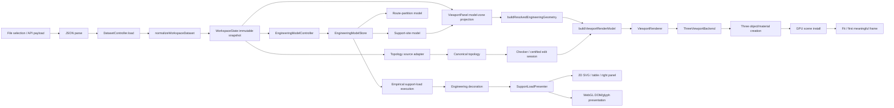
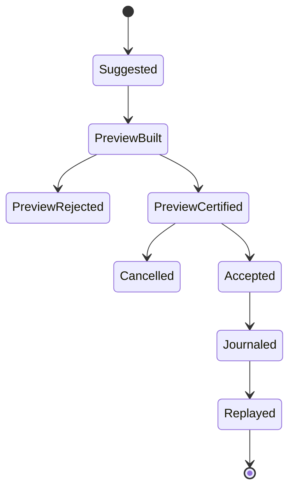

# Non-FEA Workspace Hardening Programme

## Ground-Truth Implementation Plan for P0–P7

**Repository:** `reallaksh19/Advanced_Analysis`
**Programme branch:** `orchestrator/non-fea-workspace-hardening`
**Live `main` frozen for this plan:** `0bad5b4200a8e24a358e76b1ea8372da33485c87`
**Observed historical baseline:** `e4d7392e0404b262eef6d3a4d30db663634fe66e`
**Baseline delta at plan preparation:** live `main` is nine commits ahead of the historical baseline.
**Document status:** Owner ground-truth implementation contract.
**Applies to:** Non-FEA engineering workspace only.
**Does not authorize:** LFEA/LAFEA formulation, solver, result recovery, code stress, nonlinear analysis, or modification of qualified LFEA producer contracts.

---

## 1. Purpose and authority

This document converts the P0–P7 Non-FEA mandate into an auditable, implementable programme. It is the controlling plan for:

1. current-main audit and ownership freeze;
2. import and geometry-rendering performance;
3. topology validation and deterministic correction;
4. professional 3D Edit qualification;
5. large-model navigation and orientation;
6. line-list and piping-class enrichment;
7. empirical gravity-load formula qualification;
8. common 2D/3D/right-panel presentation of empirical, sealed first-cut, and read-only qualified LFEA results.

The implementation must correct current production behavior on current `main`. Pull requests are delivery containers only. A merged PR, source inspection, or a passing focused mock is not proof of current production behavior.

### 1.1 Authority hierarchy

When evidence conflicts, apply this order:

1. **Owner-approved Work Pack and this document.**
2. **Current `origin/main` production code and registered command behavior.**
3. **Approved Project Data, master-data records, source package evidence, and authorized handoff records.**
4. **Independent benchmark or hand-calculation oracle.**
5. **Executable tests against the exact branch head.**
6. **Historical PR descriptions and issue narratives.**
7. **Unmerged candidate branches.**

Unmerged M004–M006 branches are candidate evidence only. They must not be represented as production behavior until independently reviewed, synchronized, executed, and merged.

### 1.2 Non-negotiable engineering rules

- Fail closed with named error or blocker codes.
- Never substitute zero for missing engineering input.
- Never choose a first row, nearest object, substring match, or fuzzy identity.
- Never mutate imported source stagedJson during import, preflight, qualification, or calculation.
- Preserve exact source paths, IDs, semantic hashes, ordering, diagnostics, and model-zone identity.
- Stable IDs and hashes must exclude time, randomness, locale ordering, object traversal order, and self-referential hash fields.
- Use the repository shared canonical serialization, semantic hash, and deep-freeze utilities.
- Freeze each constructed contract once at its public boundary.
- Keep rendering/presentation state outside canonical engineering topology.
- Maintain one live WebGL canvas and one existing dirty-render/animation owner.
- Labels, HUDs, load glyphs, diagnostics, and issue overlays must not enter engineering bounds or normal picking.
- Do not alter LFEA producers to simplify UI presentation.
- No coding agent may merge its own PR.
- Every merged Work Pack is followed by current-main regression.

---

## 2. Programme intake and current-state boundary

### 2.1 Current production facts at the frozen SHA

The following production seams exist on `main`:

- `DatasetController.load()` calls `normalizeWorkspaceDataset()`.
- `normalizeWorkspaceDataset()` creates a source snapshot, indexes staged source data, builds immutable entities/hierarchy/summary, and projects a shared piping model.
- `EngineeringModelController` rebuilds only when the normalized dataset reference changes; Project Data changes force a rebuild.
- `EngineeringModelStore` builds `support-site-model/v1` and `route-partition-model/v1`.
- `ViewportPanel.renderDataset()` performs model-zone projection, support-site projection, resolved geometry construction, render-model construction, and renderer installation synchronously.
- `buildResolvedEngineeringGeometry()` produces source-backed primitives and support markers.
- `buildViewportRenderModel()` creates `viewport-render-model/v3`.
- `ThreeViewportBackend` owns one renderer, camera/controls, dirty frame, selection, cached scene bounds, context lifecycle, and axis HUD.
- `renderThreeModel()` currently clears and reconstructs Three scene objects for every render-model replacement.
- `TopologyEditCertifiedSession` provides deterministic journal/replay, command acceptance, preview acceptance, undo, redo, and stale-base rejection.
- The merged M003 topology-edit path materializes governed support/restraint glyphs and retains exact support/restraint evidence; this is a production input to P0/P3/P4, not proof of full browser qualification.
- `calculateSupportLoadDistribution()` implements empirical gravity-load distribution for active load cases.
- `AuthorizedEnrichmentConsumerController` validates authorized empirical and stagedJson requests.
- `SupportLoadPresenter` selects qualified LFEA first, current calculated empirical OPE second, and sealed first-cut third.

### 2.2 M-series intake decision

At this plan’s baseline:

- M001, M002, and M003 are merged and are current production inputs.
- M004–M006 are unmerged candidate branches.
- P0 must inventory current `main` and separately record candidate deltas.
- P1/P4 may reuse M004–M006 only after each candidate is synchronized and accepted through the Work Pack process.
- Candidate code must not be copied blindly; production invariants and current-main tests govern acceptance.

### 2.3 Pre-P0 branch record

Before modifying any production file:

```bash
git fetch origin --prune
git checkout orchestrator/non-fea-workspace-hardening
git status --short
git rebase origin/main
git rev-parse HEAD
git rev-parse origin/main
git merge-base HEAD origin/main
git rev-list --left-right --count origin/main...HEAD
```

Required record:

```text
LIVE_MAIN_SHA:
ORCHESTRATOR_BRANCH:
PRE_REBASE_HEAD:
POST_REBASE_HEAD:
MERGE_BASE:
COMMITS_AHEAD:
COMMITS_BEHIND:
CONFLICTED_FILES:
RESOLUTION_SUMMARY:
WORKTREE_STATUS:
```

Any rebase conflict in `package.json`, shared workspace controllers, render-model modules, topology code, or common enrichment must be reviewed semantically. A textual merge is insufficient.

---

## 3. End-to-end production route



### 3.1 Stage contract table

| Stage | Current entry point | Input | Output | Mutation | Primary Work Pack |
|---|---|---|---|---|---|
| File read | browser/file-input or public API | file/blob | bytes/text | none | P0/P1 |
| JSON parse | caller before `DatasetController.load()` | text | JS object | none | P0/P1 |
| Source index | `indexWorkspaceSourcePackage()` | source snapshot | indexed source model | none | P0/P1 |
| Normalize | `normalizeWorkspaceDataset()` | raw package + source evidence | `analysis-workspace-dataset/v1` | none | P0/P1 |
| Workspace publish | `WorkspaceState.loadDataset()` | immutable dataset | snapshot/event | workspace state only | P0/P1 |
| Engineering rebuild | `EngineeringModelStore.rebuild()` | dataset + Project Data | support/route models | store replacement | P0/P1/P2 |
| Support sites | `buildSupportSiteModel()` | dataset + profile | `support-site-model/v1` | none | P0/P2/P5/P6 |
| Route partition | `buildRoutePartitionModel()` | dataset + profile | `route-partition-model/v1` | none | P0/P2/P6 |
| Geometry resolve | `buildResolvedEngineeringGeometry()` | dataset + profile + support sites | `resolved-engineering-geometry/v1` | none | P0/P1 |
| Render model | `buildViewportRenderModel()` | resolved geometry | `viewport-render-model/v3` | none | P0/P1 |
| Three install | `renderThreeModel()` | render model | objects/materials/maps | renderer-owned | P0/P1/P4 |
| Navigation | `ThreeViewportBackend` | pointer/commands | camera state/frame | renderer-owned | P4 |
| Canonical edit | `TopologyEditCertifiedSession` | canonical topology + commands | journal/replay topology | session-owned | P2/P3 |
| Enrichment handoff | `AuthorizedEnrichmentConsumerController` | authorized request | empirical result or stagedJson artifact | authorized stores/download only | P5 |
| Empirical calculation | `calculateSupportLoadDistribution()` | dataset/profile/support/routes/masters | `support-load-distribution/v3` | none | P6 |
| Presentation | `SupportLoadPresenter` | decorated support/result stores | callout/inspector/table values | none | P7 |

---

## 4. Programme dependency graph

```text
PRECONDITION: live-main rebase + branch freeze
    |
    v
P0 Current-main audit and ownership freeze
    |
    +--------------------+----------------------+
    |                    |                      |
    v                    v                      v
P1 Import/render     P5 Enrichment         P6-A Formula register
performance          audit/workflow        and read-only audit
    |                    |                      |
    v                    +----------+-----------+
P4 Navigation                   stable authorities
certification                         |
                                      v
P6-B Empirical production corrections
    |
    +--------------------------+
    |                          |
P2 Topology validation         |
    |                          |
    v                          |
P3 3D Edit qualification       |
    |                          |
    +-------------+------------+
                  v
P7 Common load presentation
```

Additional constraints:

- P1 and P2 may not edit the same workspace controller or render-model file concurrently.
- P3 cannot begin before P2 has zero unexplained topology failures.
- P4 browser qualification must pass before P7 WebGL work.
- P6 production correction cannot begin until P5 freezes the input authority.
- P7 begins only after authorized empirical execution, presenter behavior, and navigation baseline pass.

---

## 5. Cross-cutting implementation architecture

### 5.1 Immutable stage envelopes

Every expensive pure stage shall expose an evidence envelope:

```js
export function createStageResult({
  schema,
  inputSemanticHash,
  output,
  diagnostics,
  metrics,
}) {
  const draft = {
    schema,
    inputSemanticHash,
    output,
    diagnostics: [...diagnostics],
    metrics: { ...metrics },
  };
  return deepFreeze({
    ...draft,
    semanticHash: semanticHash(draft),
  });
}
```

Rules:

- `semanticHash` is added only after constructing the hash projection.
- Metrics containing wall-clock duration are operational evidence and are excluded from engineering semantic hashes.
- Output engineering contracts remain unchanged unless a Work Pack explicitly versions them.
- Reuse decisions compare explicit immutable references or semantic hashes, never hidden global caches.

### 5.2 Deterministic ordering

Use explicit code-unit comparison:

```js
export function compareCodeUnits(left, right) {
  const a = String(left);
  const b = String(right);
  return a < b ? -1 : a > b ? 1 : 0;
}
```

Do not use `localeCompare()` in stable identity, hash, issue, route, support, or evidence ordering.

### 5.3 Named failure construction

```js
export function nonFeaError(code, message, details = null) {
  const error = new Error(`${code}: ${message}`);
  error.code = code;
  error.details = details === null ? null : deepFreeze(details);
  return error;
}
```

Each Work Pack maintains a register of codes and proves:

- trigger condition;
- no fallback;
- deterministic details;
- browser/user presentation where applicable.

### 5.4 Source non-mutation proof

For every fixture:

```js
const sourceBefore = sha256(sourceBytes);
const rawBefore = semanticHash(rawPackage);

const result = runProductionPath(rawPackage, sourceBytes);

assert.equal(sha256(sourceBytes), sourceBefore);
assert.equal(semanticHash(rawPackage), rawBefore);
```

### 5.5 Process log

Each Work Pack emits a JSON execution log:

```json
{
  "schema": "non-fea-work-pack-execution/v1",
  "workPack": "P1",
  "liveMainSha": "...",
  "baseSha": "...",
  "headSha": "...",
  "commands": [],
  "fixtures": [],
  "failures": [],
  "metrics": {},
  "outputHashes": {},
  "sourceNonMutation": {},
  "determinism": {},
  "disposition": "UNRESOLVED_GATE"
}
```

Command output is retained verbatim or by artifact path plus SHA-256. No command is reported as passing unless executed at the exact recorded head.

---

# P0 — Current-Main Baseline and Ownership Freeze

## P0.1 Objective

Produce an executable, read-only map of the complete Non-FEA production route and freeze the subsequent Work Pack boundaries. P0 does not correct production behavior.

## P0.2 Deliverables

Required:

- `docs/non-fea-current-main-audit.md`
- `reports/non-fea-current-main-baseline.json`
- `docs/non-fea-work-pack-map.md`

Recommended supporting files:

- `scripts/run-non-fea-current-main-baseline.mjs`
- `scripts/non-fea-baseline/stage-recorder.mjs`
- `scripts/non-fea-baseline/browser-baseline.mjs`
- `tests/non-fea-p0-route-map.test.mjs`

The orchestrator must stop after P0 and obtain Owner acceptance.

## P0.3 Production-path inventory requirements

For each stage record:

- exported entry point;
- owning file;
- input/output schema;
- triggering event or public method;
- source/workspace mutation behavior;
- synchronous main-thread behavior;
- repeat/rebuild condition;
- cache/invalidation rule;
- current test coverage;
- current issue/PR;
- present defect or uncertainty;
- intended Work Pack owner;
- forbidden parallel owner.

The inventory must include:

```text
FILE READ
JSON PARSE
SOURCE SNAPSHOT
SOURCE INDEX
NORMALIZATION
SHARED MODEL
WORKSPACE SNAPSHOT
ENGINEERING MODEL
SUPPORT SITES
ROUTE PARTITION
MODEL-ZONE PROJECTION
RESOLVED GEOMETRY
RENDER MODEL
THREE MATERIALIZATION
GPU SCENE INSTALL
FIT
FIRST MEANINGFUL FRAME
SELECTION
ORBIT/PAN
CANONICAL TOPOLOGY
CHECKER
EDIT PREVIEW/APPLY/UNDO/REDO
ENRICHMENT PROJECTION
AUTHORIZED HANDOFF
EMPIRICAL CALCULATION
LOAD PRESENTATION
```

## P0.4 Required fixtures

- `benchmarks/ATTRIBUTE-AML_ASIM-1835_managed_stage_enriched_stage.json`
- `benchmarks/Sjson.json`
- `benchmarks/1885Sjson/EnrichedSjson`
- existing 20-object topology-edit fixture;
- portable 4,884-entity or current repository equivalent;
- existing real 1885 support/branch fixtures.

Every fixture record includes:

```json
{
  "path": "...",
  "sourceSha256": "...",
  "byteLength": 0,
  "declaredUse": ["normalization", "topology"],
  "realOrSimulated": "REAL_REPOSITORY_FIXTURE",
  "expectedIdentity": {},
  "authorityNotes": []
}
```

## P0.5 Separated timing methodology

Never report one import duration.

Required stage measurements:

1. file read;
2. UTF-8 decode;
3. JSON parse;
4. source snapshot;
5. source index;
6. entity normalization;
7. shared-model projection;
8. WorkspaceState publication;
9. support-site construction;
10. route construction;
11. model-zone projection;
12. geometry compilation;
13. render-model construction;
14. Three geometry creation;
15. Three material creation;
16. scene installation;
17. fit-to-model;
18. first meaningful frame;
19. first selection;
20. first orbit response.

Implement an operational timer that cannot affect engineering output:

```js
export async function recordStage(recorder, stageId, operation) {
  const started = performance.now();
  try {
    const value = await operation();
    recorder.push({
      stageId,
      status: 'PASS',
      durationMs: performance.now() - started,
    });
    return value;
  } catch (error) {
    recorder.push({
      stageId,
      status: 'FAIL',
      durationMs: performance.now() - started,
      code: error?.code || 'UNCLASSIFIED_ERROR',
      message: error instanceof Error ? error.message : String(error),
    });
    throw error;
  }
}
```

Browser timing markers must use `performance.mark()`/`performance.measure()` and an exact fixture/run ID. They are not included in semantic hashes.

## P0.6 Long-task evidence

Install a test-only browser observer:

```js
const longTasks = [];
const observer = new PerformanceObserver((list) => {
  for (const entry of list.getEntries()) {
    longTasks.push({
      startTimeMs: entry.startTime,
      durationMs: entry.duration,
    });
  }
});
observer.observe({ type: 'longtask', buffered: true });
```

If browser support is unavailable, record `INFRASTRUCTURE_BLOCKER`; do not infer long-task behavior from aggregate duration.

## P0.7 Failure ledger

Every failure is classified exactly once:

```text
PRODUCT_DEFECT
REGRESSION
PRE_EXISTING_CURRENT_MAIN_DEFECT
INFRASTRUCTURE_BLOCKER
STALE_TEST
MISSING_AUTHORITY
OUT_OF_SCOPE_DEPENDENCY
UNRESOLVED_GATE
```

For topology-specific failures also record:

```text
AUTHORITY_DEFECT
NORMALIZATION_DEFECT
TOPOLOGY_DEFECT
AUTOFIX_DEFECT
EDIT_TRANSACTION_DEFECT
RENDERER_DEFECT
STALE_TEST
MISSING_FIXTURE_AUTHORITY
INFRASTRUCTURE_BLOCKER
```

## P0.8 Changed-file ownership matrix

P0 must publish exact ownership before parallel work. Initial ownership:

| Area | P1 | P2 | P3 | P4 | P5 | P6 | P7 |
|---|---:|---:|---:|---:|---:|---:|---:|
| `dataset-controller.js` | owner | read | no | no | read | read | no |
| `dataset-adapter.js` | owner | read | no | no | read | read | no |
| `engineering-model-controller.js` | owner | shared-stop | no | no | read | shared-stop | read |
| `engineering-model-store.js` | owner | shared-stop | no | no | read | shared-stop | read |
| `support-sites/**` | read | owner | read | read | read | shared-stop | read |
| `routes/**` | read | owner | read | read | read | shared-stop | read |
| `resolved-engineering-geometry.js` | owner | read | read | read | no | no | read |
| `viewport-render-model.js` | owner | read | read | read | no | no | read |
| `three-viewport-*` | owner | no | read | owner after P1 | no | no | P7 overlay only |
| `topology-edit/**` | read | owner | owner after P2 | P4 routing only | no | no | read |
| `enrichment/**` | no | no | no | no | owner | read | adapter only |
| `engineering-loads/**` | no | read | no | no | authority read | owner | read |
| `SupportLoadPresenter` | no | no | no | no | read | read | owner |

Any overlap not shown here triggers a Work Pack stop and ownership revision.

## P0.9 P0 tests and command ladder

```bash
npm ci

node scripts/benchmark-workspace-normalization.mjs \
  --fixture benchmarks/ATTRIBUTE-AML_ASIM-1835_managed_stage_enriched_stage.json \
  --max-normalize-ms 3000

node scripts/benchmark-workspace-normalization.mjs \
  --fixture benchmarks/Sjson.json

npm run check:workspace-contracts
npm run check:first-cut
npm run check:first-cut-engineering-benchmarks
node scripts/w10.6-engineering-benchmark-check.mjs

node scripts/run-authorized-empirical-load-execution-checks.mjs
node scripts/run-authorized-enrichment-workspace-api-checks.mjs
node scripts/run-authorized-empirical-execution-view-checks.mjs

npm run check:sequential-sketcher

node --test --test-concurrency=1 tests/topology-edit-*.test.mjs
node --test tests/three-viewport-navigation.test.mjs

npx playwright test \
  e2e/three-viewport-navigation.spec.js \
  --workers=1 \
  --reporter=line

npm run syntax:strict
npm run build
git diff --check
git status --short
```

P0 records every output without correction.

## P0.10 Stop conditions

Stop P0 and return `UNRESOLVED_GATE` when:

- live main cannot be frozen;
- a required fixture is missing or its authority is unclear;
- the full route cannot be traced to a production entry point;
- browser launch fails for a product reason;
- command registration differs from this plan and is not reconciled;
- current-main failures are omitted or reclassified without evidence.

---

# P1 — Import and Geometry-Rendering Performance

## P1.1 Objective

Meet import-to-first-frame and interaction thresholds without changing normalized engineering meaning, topology, source identity, support-site identity, diagnostics, or selection/picking identity.

## P1.2 Verified current seams to profile

Current implementation performs:

- synchronous normalization in `DatasetController.load()`;
- synchronous support/route rebuild in `EngineeringModelStore.rebuild()`;
- synchronous geometry/render-model reconstruction in `ViewportPanel.renderDataset()`;
- complete Three group teardown and recreation in `renderThreeModel()`;
- full raycast candidate flattening on pick;
- full-scene object maps and bounds;
- engineering-changed events that can trigger full viewport rebuilds.

P1 must verify which of these are actual bottlenecks before changing them.

## P1.3 Frozen thresholds

Owner reference-machine initial targets:

| Metric | Threshold |
|---|---:|
| 4,884-entity normalization | `<= 3000 ms` |
| File selection to first meaningful WebGL frame | `<= 5000 ms` |
| Post-parse main-thread task | `<= 200 ms` |
| Orbit/pan p95 frame | `<= 33 ms` |
| Selection response p95 | `<= 100 ms` |
| Live WebGL canvases | exactly `1` |
| Dirty-render/animation owners | exactly `1` |
| Page errors | `0` |
| Normalized-result hash | unchanged |
| Unresolved diagnostics | no increase |

If hardware cannot meet a threshold, freeze the revised machine-specific threshold before production edits.

## P1.4 Implementation sequence

### P1-A — Performance evidence index

Add a per-import operational context, owned by `DatasetController` or a dedicated import coordinator:

```js
export function createImportExecution({
  executionId,
  sourceName,
  sourceSha256,
}) {
  return {
    executionId,
    sourceName,
    sourceSha256,
    stageMetrics: [],
    products: new Map(),
  };
}
```

This context is not engineering authority and is discarded on clear/destroy.

### P1-B — Explicit immutable product reuse

Reuse only through named controller fields:

```js
class EngineeringModelStore {
  #dataset = null;
  #profileHash = null;
  #supportSiteModel = null;
  #routePartitionModel = null;

  rebuild(dataset, profile) {
    const profileHash = semanticHash(topologyProjection(profile));
    if (dataset === this.#dataset && profileHash === this.#profileHash) {
      return { disposition: 'REUSED' };
    }

    const supportSiteModel = buildSupportSiteModel(dataset, profile);
    const routePartitionModel = buildRoutePartitionModel(dataset, profile);

    this.#dataset = dataset;
    this.#profileHash = profileHash;
    this.#supportSiteModel = supportSiteModel;
    this.#routePartitionModel = routePartitionModel;
    return { disposition: 'REBUILT' };
  }
}
```

Do not use a module-global cache or hidden `WeakMap`.

### P1-C — Separate compile from install

Refactor `ViewportPanel.renderDataset()` into pure compile and imperative install:

```js
function compileViewportProducts({
  dataset,
  zoneSelection,
  profile,
  supportSiteModel,
}) {
  const zoneProjection = projectDatasetForModelZone(dataset, zoneSelection);
  const supportSites = projectSupportSiteModelForModelZone(
    supportSiteModel,
    zoneProjection,
  );
  const resolved = filterResolvedGeometryForModelZone(
    buildResolvedEngineeringGeometry(dataset, profile, supportSites),
    zoneProjection,
    supportSites,
  );
  return deepFreeze({
    zoneProjection,
    supportSites,
    resolved,
    renderModel: buildViewportRenderModel(resolved),
  });
}
```

Cache this envelope by explicit dataset reference, dataset version, zone identity, profile semantic hash, and support-site semantic hash.

### P1-D — Event cascade coalescing

Selection-only events must never rebuild engineering products.

Use explicit invalidation classes:

```js
const INVALIDATION = Object.freeze({
  SELECTION: 'SELECTION',
  PRESENTATION: 'PRESENTATION',
  MODEL_ZONE: 'MODEL_ZONE',
  ENGINEERING_MODEL: 'ENGINEERING_MODEL',
  SOURCE_DATASET: 'SOURCE_DATASET',
});

function requiresModelCompile(reason) {
  return reason === INVALIDATION.MODEL_ZONE
    || reason === INVALIDATION.ENGINEERING_MODEL
    || reason === INVALIDATION.SOURCE_DATASET;
}
```

Prove each event maps to exactly one invalidation reason.

### P1-E — Bounded yielding or worker preparation

Only pure, serializable preparation may move off the main thread:

- source indexing;
- normalization;
- hierarchy construction;
- geometry/render-model compilation.

Do not move DOM, Project Data store access, mutable workspace state, Three.js objects, or browser file handles into the worker.

Worker result must include input hashes and be revalidated before publication:

```js
if (message.sourceSha256 !== activeImport.sourceSha256) {
  throw nonFeaError(
    'IMPORT_WORKER_SOURCE_MISMATCH',
    'Worker result does not match the active source.',
  );
}
```

If workers are not needed after profiling, use deterministic chunks and yield between chunks without changing order:

```js
for (let offset = 0; offset < rows.length; offset += chunkSize) {
  processRows(rows.slice(offset, offset + chunkSize));
  await schedulerYield();
}
```

### P1-F — Three resource reuse

Introduce per-backend, per-model-install resource pools:

```js
class ThreeResourcePool {
  constructor() {
    this.geometries = new Map();
    this.materials = new Map();
  }

  geometry(signature, create) {
    if (!this.geometries.has(signature)) {
      this.geometries.set(signature, create());
    }
    return this.geometries.get(signature);
  }

  material(signature, create) {
    if (!this.materials.has(signature)) {
      this.materials.set(signature, create());
    }
    return this.materials.get(signature);
  }

  dispose() {
    new Set(this.geometries.values()).forEach((g) => g.dispose());
    new Set(this.materials.values()).forEach((m) => m.dispose());
    this.geometries.clear();
    this.materials.clear();
  }
}
```

Signatures may include only governed geometry/material parameters. Exact pick evidence remains per object/instance.

### P1-G — Instancing

Instancing is allowed only when all candidates have:

- identical geometry signature;
- identical material signature;
- finite transforms;
- exact pick target;
- supported section/clipping behavior;
- deterministic instance order.

Each `InstancedMesh` retains a pick table:

```js
mesh.userData.pickTable = candidates.map((row) => row.pickTarget);
mesh.userData.partRoleTable = candidates.map((row) => row.partRole);
```

Pick targets must be byte-for-byte unchanged.

### P1-H — Incremental scene replacement

Classify render-model changes:

```text
IDENTICAL_MODEL
PRESENTATION_ONLY
SELECTION_ONLY
VISIBILITY_ONLY
PRIMITIVE_DELTA
FULL_REPLACEMENT
```

Only `FULL_REPLACEMENT` clears all engineering groups. Selection and load-label changes must not rebuild geometry.

### P1-I — Virtualized operational tables

All large line/component/diagnostic tables use a windowed row model:

- fixed or measured row height;
- visible range + overscan;
- deterministic row identity;
- keyboard/selection parity;
- no loss of exception counts;
- no hidden dropped diagnostics.

## P1.5 P1 test requirements

### Unit and contract

- normalized output deep equality and hash equality before/after optimization;
- hierarchy, shared-model, support-site, route, geometry, and render-model hashes unchanged;
- selection-only event does not call rebuild/compile/install;
- source bytes and raw package unchanged;
- pool signatures deterministic under reorder;
- instanced pick table parity;
- pooled resources disposed once;
- unsupported geometry remains ordinary meshes;
- model-zone filter exactness retained.

### Performance

Run at least 10 warm and 5 cold iterations. Report median, p95, max, and sample count.

### Browser

- real large model import;
- first meaningful frame marker;
- long-task ledger;
- first pick;
- repeated orbit/pan;
- selection-only update;
- model-zone change;
- clear/reload;
- context loss/restore;
- destroy;
- one canvas;
- zero page errors.

## P1.6 P1 stop conditions

- normalized hash changes;
- diagnostic count drops;
- selection identity changes;
- a cache outlives its dataset/controller lifecycle;
- worker result cannot be bound to exact source hash;
- LOD/simplification changes engineering location;
- instancing loses exact pick identity;
- a second render loop or canvas is introduced.

---

# P2 — Topology Core Validation and Repair

## P2.1 Objective

Establish a trustworthy, deterministic topology core before general 3D Edit activation. Zero unexplained topology failures are allowed.

## P2.2 Canonical topology invariants

The canonical graph must retain:

```ts
type CanonicalNode = {
  id: string;
  position: { x: number; y: number; z: number };
  sourceEntityIds: readonly string[];
  sourcePaths: readonly string[];
  revision: number;
};

type CanonicalEdge = {
  id: string;
  fromNodeId: string;
  toNodeId: string;
  componentKind: string;
  sourceEntityIds: readonly string[];
  sourcePaths: readonly string[];
  diameterMm: number | null;
  revision: number;
};
```

Required invariants:

- node and edge IDs are unique;
- all edge endpoints exist;
- positions are finite engineering coordinates;
- exact source identity is retained;
- no implicit join exists without canonical node authority;
- a crossing is not a join unless an explicit node/junction says so;
- support attachment is exact and evidence-backed;
- all canonical arrays are deterministically ordered;
- the canonical hash excludes its own hash field.

## P2.3 Endpoint matching logic

### Priority

1. explicit source endpoint identity;
2. exact canonical node identity;
3. exact coordinate equality within the same authorized topology scope;
4. approved tolerance only to create a **candidate issue**, never an automatic join.

Implement an endpoint index:

```js
export function buildEndpointIndex(edges) {
  const bySourceEndpoint = new Map();
  const byExactPoint = new Map();

  for (const edge of [...edges].sort((a, b) => compareCodeUnits(a.id, b.id))) {
    for (const endpoint of ['from', 'to']) {
      const record = edge.endpoints[endpoint];
      push(bySourceEndpoint, record.sourceEndpointId, { edgeId: edge.id, endpoint });
      push(byExactPoint, pointKey(record.position), { edgeId: edge.id, endpoint });
    }
  }

  return deepFreeze({
    bySourceEndpoint: freezeEntries(bySourceEndpoint),
    byExactPoint: freezeEntries(byExactPoint),
  });
}
```

No `find()` first-match authority is allowed where duplicates are possible.

## P2.4 Coincident and near-coincident nodes

Classify:

```text
EXACT_DUPLICATE_SAME_AUTHORITY
EXACT_DUPLICATE_CONFLICTING_AUTHORITY
NEAR_COINCIDENT_CANDIDATE
DISTINCT
```

A near-coincident pair may produce `SNAP_GAP` only when:

- both are graph-open endpoints;
- they belong to different connected components;
- distance is positive and within approved tolerance;
- no conflicting source/junction/support evidence exists;
- candidate direction is finite;
- the preview does not create overlap, backtrack, or clearance failures.

## P2.5 Connected components and branch logic

Use deterministic BFS/DFS:

```js
export function connectedComponents(nodeIds, edges) {
  const neighbors = buildNeighborMap(nodeIds, edges);
  const visited = new Set();
  const components = [];

  for (const seed of [...nodeIds].sort(compareCodeUnits)) {
    if (visited.has(seed)) continue;
    const queue = [seed];
    const component = [];
    visited.add(seed);

    while (queue.length) {
      const current = queue.shift();
      component.push(current);
      for (const next of [...neighbors.get(current)].sort(compareCodeUnits)) {
        if (!visited.has(next)) {
          visited.add(next);
          queue.push(next);
        }
      }
    }
    components.push(component.sort(compareCodeUnits));
  }
  return components;
}
```

Do not identify the “main” component solely by source order. Record size, branch identity, source authority, and unchanged-baseline component status.

## P2.6 Crossing versus join

Two segments that geometrically intersect are:

- `TRUE_JOIN` only when they share an explicit canonical node or governed junction;
- `CROSSING_WITHOUT_JOIN` when centerlines cross but identity does not;
- `OVERLAP` when collinear overlap exceeds tolerance;
- `CLEARANCE_CLASH` when physical envelopes violate approved clearance;
- `NO_INTERACTION` otherwise.

No proximity-only mutation is authorized.

## P2.7 Bend, elbow, tee, reducer, and OLET logic

- Exact `ELBO` classification remains a bend.
- `ELBOLET` must not be classified as an elbow by substring.
- A two-way direction change without bend authority is an issue.
- A bend with no direction change is an issue.
- A degree-three-or-more node requires explicit junction evidence.
- A tee/OLET endpoint must resolve by exact canonical endpoint identity.
- Reducer inlet/outlet identity and eccentric offset evidence must be preserved.
- Component geometry is presentation evidence and must not become topology authority.

## P2.8 Support attachment logic

Attachment resolution order:

1. explicit source member-to-component reference;
2. explicit canonical node/edge identity;
3. exact support-site membership;
4. tolerance candidate requiring preview and Owner-approved rule.

Never relocate a support by nearest coordinate.

## P2.9 Issue identity

Replace locale-dependent ordering in stable issue logic:

```js
export function topologyIssueId(kind, target) {
  const identity = [
    ...(target.nodeIds || []),
    ...(target.edgeIds || []),
    target.junctionId,
    target.supportId,
    target.restraintId,
  ].filter(Boolean).sort(compareCodeUnits);

  return `issue:${kind}:${semanticHash({ kind, identity })}`;
}
```

Issue identity must be invariant under input reorder.

## P2.10 Autofix lifecycle



Candidate record:

```js
const candidate = deepFreeze({
  schema: 'topology-autofix-candidate/v1',
  issueId,
  commandType,
  payload,
  basis: {
    sourceHash,
    baseCanonicalHash,
    priorDraftHash,
    sessionVersion,
  },
  beforeTopologyHash,
  candidateTopologyHash,
  expectedIssueDisposition,
  guardEvidence,
  candidateHash: semanticHash(candidateProjection),
});
```

Acceptance requires:

- current basis equals preview basis;
- command/payload equals preview command/payload;
- replayed candidate hash equals preview candidate hash;
- blocking issue count does not increase;
- intended issue is resolved;
- no new source identity is invented.

## P2.11 Transaction proof

For each command:

```text
BASE_HASH
PREVIEW_HASH
COMMIT_HASH == PREVIEW_HASH
UNDO_HASH == BASE_HASH
REDO_HASH == COMMIT_HASH
```

A stale workspace base blocks the session.

## P2.12 P2 failure ledger

Every current topology test failure is reproduced and classified. No inherited count is accepted.

Required real-data runs:

- existing 20-object topology model;
- real 1885 enriched stagedJson;
- 4,884-entity model;
- branches with elbows, tees, reducers, supports;
- reorder-determinism runs.

## P2.13 P2 tests

### Positive

- exact endpoint topology;
- exact small-gap candidate;
- valid merge/bridge/split/disconnect/delete;
- true tee/junction;
- elbow direction change;
- support attachment;
- deterministic issue and topology hashes;
- preview/apply/undo/redo parity.

### Negative

- large discontinuity remains manual;
- branch disconnection remains blocking;
- unchanged disconnected component is not relabeled as newly broken;
- crossing without node is not joined;
- ELBOLET not bend;
- first-found/fuzzy/nearest selection rejected;
- overlapping edge introduced by fix rejected;
- support movement without preview rejected;
- stale preview rejected;
- source identity rewrite rejected;
- duplicate node ambiguity retained.

### Property/reorder

Generate deterministic permutations of nodes/edges/supports and require identical canonical, issue, candidate, and journal hashes.

## P2.14 P2 stop conditions

- missing source authority;
- tolerance not approved in Project Data;
- preview cannot be reproduced exactly;
- production result and test expectation disagree without independent oracle;
- any unexplained failure remains;
- a fix requires fuzzy identity or source mutation.

---

# P3 — Professional 3D Edit Tool Audit and Activation

## P3.1 Objective

Qualify every visible or registered 3D Edit tool through the real UI and real WebGL backend after P2 certifies topology.

## P3.2 Current known tool actions

Current `TOPOLOGY_EDIT_COMMAND_ACTIONS` includes:

- Move node +Z by exact 100 mm;
- Set exact 3 mm gap;
- Set exact 20 mm gap;
- Merge nodes;
- Bridge gap;
- Add straight element;
- Split edge at 50%;
- Disconnect FROM endpoint;
- Disconnect TO endpoint;
- Delete edge.

P3 must also inventory every other toolbar/menu registration in the repository. Operations such as rotate, stretch, copy, grouped edits, and support relocation are not assumed to exist merely because the old programme lists them.

## P3.3 Required disposition

Every visible tool:

```text
ACTIVE_AND_QUALIFIED
ACTIVE_WITH_EXPLICIT_LIMITATION
DISABLED_WITH_REASON
REMOVED_AS_DEAD_UI
```

No visible tool may silently do nothing.

## P3.4 Tool descriptor contract

```js
const TOOL = deepFreeze({
  id: 'split-edge-half',
  label: 'Split edge 50%',
  selectionContract: {
    nodeCount: 0,
    edgeCount: 1,
    supportCount: 0,
  },
  commandType: 'SPLIT_EDGE',
  previewRequired: true,
  topologyGuards: [
    'EDGE_EXISTS_EXACTLY_ONCE',
    'EDGE_NOT_ZERO_LENGTH',
    'SPLIT_POINT_INTERIOR',
  ],
  limitationCodes: [],
});
```

A single registry drives toolbar rendering, shortcut claims, selection validation, preview, and test inventory.

## P3.5 Tool state machine

```text
IDLE
→ SELECTION_VALIDATED
→ COMMAND_BUILT
→ PREVIEW_CERTIFIED
→ USER_ACCEPTED | CANCELLED
→ JOURNAL_ACCEPTED
→ RENDER_REFRESHED
```

Invalid topology or stale basis returns to `IDLE` with named reason and no mutation.

## P3.6 Exact preview commitment

```js
function acceptToolPreview(session, preview) {
  const currentBasis = session.commandBasis();
  if (semanticHash(currentBasis) !== semanticHash(preview.basis)) {
    throw nonFeaError(
      'TOPOLOGY_EDIT_PREVIEW_STALE',
      'The active edit basis changed after preview.',
    );
  }

  const transition = session.execute(
    preview.commandType,
    preview.payload,
    preview.options,
  );

  if (transition.replay.activeCanonicalTopologyHash
      !== preview.candidateTopologyHash) {
    throw nonFeaError(
      'TOPOLOGY_EDIT_PREVIEW_COMMIT_MISMATCH',
      'Committed topology differs from the certified preview.',
    );
  }
  return transition;
}
```

## P3.7 Preview rendering

- preview group is visually distinct;
- preview objects are non-authoritative;
- preview objects do not enter canonical topology;
- preview objects do not enter normal bounds unless explicitly fitting preview;
- clipped/hidden preview objects cannot be picked through the clip plane;
- cancel removes preview idempotently.

## P3.8 Model-zone containment

Before preview and commit:

```js
const affectedEntityIds = commandAffectedEntityIds(command, canonical);
const outsideZone = affectedEntityIds.filter(
  (id) => !activeZoneEntityIds.has(id),
);
if (outsideZone.length) {
  throw nonFeaError(
    'TOPOLOGY_EDIT_MODEL_ZONE_ESCAPE',
    'Command affects entities outside the active model zone.',
    { outsideZone },
  );
}
```

## P3.9 Browser proof

The browser test must:

1. load a real fixture through public UI/API;
2. activate 3D Edit through public controls;
3. select exact rendered nodes/edges;
4. invoke each visible tool;
5. observe preview;
6. cancel and prove no hash change;
7. re-preview and accept;
8. assert exact committed hash;
9. undo and redo;
10. exercise section clipping;
11. verify selection/picking;
12. destroy with zero retained canvas/listeners/page errors.

Direct controller calls alone are insufficient.

## P3.10 P3 tests

For every tool:

- enablement from exact selection;
- malformed selection rejection;
- preview hash;
- visible preview identity;
- commit parity;
- cancel non-mutation;
- undo/redo;
- persistence/export effect;
- model-zone containment;
- clipped/hidden picking;
- stale-base rejection;
- repeated activation/deactivation.

## P3.11 P3 stop conditions

- P2 has unresolved failures;
- visible tools cannot be traced to a command builder;
- a tool mutates source before commit;
- preview and committed candidate differ;
- browser proof requires private controller invocation;
- a tool affects outside-zone entities.

---

# P4 — Large-Model Navigation and Orientation

## P4.1 Objective

Certify responsive, precise navigation on real large models using one WebGL renderer, one canvas, one dirty frame, and engineering-coordinate preservation.

## P4.2 Core invariants

- canonical/source coordinates remain Z-up engineering coordinates;
- rendering transform remains rendering-only;
- main scene renders before HUD/orientation overlays;
- camera commands use cached physical engineering bounds;
- labels, issue overlays, load glyphs, selection outlines, and HUD are excluded from fit bounds;
- selection/picking identity is unaffected by camera operations;
- projection switching preserves apparent scale;
- context restore reproduces retained model and presentation state;
- listeners/controls dispose exactly once.

## P4.3 Dirty render contract

Replace unstructured boolean causes with evidence-backed reasons if needed:

```js
class DirtyFrameScheduler {
  #reasons = new Set();

  invalidate(reason) {
    this.#reasons.add(reason);
  }

  consume() {
    if (!this.#reasons.size) return null;
    const reasons = [...this.#reasons].sort(compareCodeUnits);
    this.#reasons.clear();
    return deepFreeze(reasons);
  }
}
```

This may still use the existing single RAF owner. It must not introduce another loop.

## P4.4 Bounds cache

```js
function physicalSceneBounds(backend) {
  if (backend.sceneBoundsCache) {
    return backend.sceneBoundsCache.clone();
  }

  const box = new THREE.Box3();
  for (const object of backend.engineeringObjects()) {
    const objectBox = new THREE.Box3().setFromObject(object);
    if (!objectBox.isEmpty()) box.union(objectBox);
  }

  backend.sceneBoundsCache = box.clone();
  return box;
}
```

Invalidate only on engineering object replacement, visibility changes that affect fit policy, or model-zone replacement.

## P4.5 Fit mathematics

Perspective:

```text
distanceY = (height / 2) / tan(fovY / 2)
distanceX = (width / 2) / tan(fovX / 2)
distance = max(distanceX, distanceY) × margin
```

Orthographic:

```text
halfHeight = max(height / 2, width / (2 × aspect)) × margin
halfWidth = halfHeight × aspect
```

Near/far must contain the protected bounding sphere and obey approved Project Data limits. Exceeding a hard range fails closed; it is not silently clamped to an unsafe value.

## P4.6 Standard views

The engineering-to-render transform is authoritative. Standard views must be tested in engineering labels:

```text
TOP: look along -engineering Z
BOTTOM: look along +engineering Z
FRONT/BACK/LEFT/RIGHT: approved engineering basis mapping
ISO: approved equal-axis direction
```

The exact rendered direction must be derived through the shared coordinate transform, not duplicated ad hoc.

## P4.7 Projection scale preservation

Perspective to orthographic:

```text
visibleHeight = 2 × distance(target,camera) × tan(effectiveFov / 2)
orthoHalfHeight = visibleHeight / 2
```

Orthographic to perspective:

```text
distance = visibleHeight / (2 × tan(fov / 2))
```

Tests compare projected reference-length pixels before/after within a frozen tolerance.

## P4.8 Floating-origin decision gate

Introduce floating origin only when real evidence shows unacceptable precision:

1. record model coordinate magnitude;
2. record projected jitter under orbit/pan;
3. record pick error in engineering mm;
4. record fit and clipping error;
5. compare against frozen limits.

If required:

- preserve engineering coordinates in all contracts;
- subtract a deterministic model origin only at render boundary;
- add origin back to pick receipts;
- bind origin to render-model evidence;
- do not change topology or source hashes.

## P4.9 Orientation HUD/cube

- consumes active camera quaternion;
- dispatches only shared navigation intents;
- no second camera, renderer, or RAF;
- active face derives from actual camera direction;
- DOM/CSS controls remain outside Three bounds/picking;
- repeated mount/destroy leaves zero duplicate roots/listeners.

## P4.10 P4 browser matrix

- import real 4,884-entity model;
- first fit;
- fit selection;
- front/back/left/right/top/bottom/ISO;
- orbit;
- pan;
- wheel zoom;
- perspective/orthographic;
- model-zone fit;
- selection focus;
- resize;
- context loss/restore;
- model replacement;
- destroy;
- one canvas;
- zero page errors;
- p95 frame/selection thresholds.

## P4.11 P4 stop conditions

- complete bounds scan per camera command;
- overlay inclusion in bounds;
- second RAF/canvas/renderer;
- source coordinate mutation;
- apparent-scale regression;
- context restore loses pick identity;
- high-coordinate precision remains unexplained.

---

# P5 — Line-List and Piping-Class Enrichment

## P5.1 Objective

Provide one exact, auditable enrichment authority from stagedJson through authorized handoff and deterministic stagedJson sidecar/export. Eliminate or block production bypasses.

## P5.2 Production route

```text
source stagedJson
→ stable target ID
→ normalized exact line key
→ line-list candidates
→ piping-class candidates
→ material / NPS / schedule / thickness
→ fluid / insulation / component mass authority
→ readiness
→ reviewer decision
→ authorized handoff
→ empirical consumer
→ sidecar/write/download
```

## P5.3 Exact identity model

Do not collapse duplicates:

```js
export function indexMasterRows(rows, keyOf) {
  const map = new Map();
  for (const row of rows) {
    const key = keyOf(row);
    const values = map.get(key) || [];
    values.push(row);
    map.set(key, values);
  }
  return map;
}
```

Resolution result:

```js
function resolveExact(index, key, evidence) {
  const rows = index.get(key) || [];
  if (rows.length === 0) {
    return blocked('MASTER_RECORD_MISSING', { key, evidence });
  }
  if (rows.length > 1) {
    return blocked('MASTER_RECORD_AMBIGUOUS', {
      key,
      candidateSourceLocators: rows.map((row) => row.sourceLocator),
    });
  }
  return ready(rows[0]);
}
```

No case folding that changes governed identity. Any normalization rule must be explicit, reversible, and source-evidenced.

## P5.4 Resolution record

```ts
type EnrichmentResolution = {
  schema: 'enrichment-resolution/v1';
  targetId: string;
  targetSourceLocator: string;
  normalizedLineKey: string;
  lineListCandidateIds: readonly string[];
  pipingClassCandidateIds: readonly string[];
  sourceValues: object;
  masterValues: object;
  resolvedValues: object | null;
  blockers: readonly object[];
  reviewerDecision: 'PENDING' | 'APPROVED' | 'REJECTED';
  approvalStatus: 'NOT_AUTHORIZED' | 'AUTHORIZED';
  sourceHashes: object;
  semanticHash: string;
};
```

## P5.5 Conflicts and staleness

Explicit blockers:

```text
DUPLICATE_LINE_KEY
LINE_LIST_RECORD_MISSING
PIPING_CLASS_RECORD_MISSING
SOURCE_MASTER_CONFLICT
MATERIAL_UNRESOLVED
NPS_UNRESOLVED
SCHEDULE_UNRESOLVED
WALL_THICKNESS_UNRESOLVED
FLUID_UNRESOLVED
INSULATION_CODE_UNRESOLVED
INSULATION_DENSITY_UNRESOLVED
COMPONENT_WEIGHT_UNRESOLVED
SOURCE_HASH_STALE
MASTER_HASH_STALE
REVIEW_REQUIRED
REJECTED_BY_REVIEWER
```

## P5.6 Reviewer decision

```js
const decision = deepFreeze({
  schema: 'enrichment-review-decision/v1',
  decisionId,
  targetId,
  resolutionSemanticHash,
  disposition: 'APPROVE',
  reviewerId,
  decidedAt,
  comment,
  semanticHash: semanticHash(decisionProjection),
});
```

Time is retained as audit evidence but excluded from stable engineering identity where required. The decision binds the exact resolution hash.

## P5.7 Authorized handoff

`AuthorizedEnrichmentConsumerController` remains the production gate. P5 must prove:

- exact request keys;
- authorized input schema;
- active source/master hashes;
- readiness/decision hash match;
- consumer identity;
- no local override;
- no default/zero/first-row behavior.

Bypass inventory statuses:

```text
HANDOFF_GATED
LEGACY_BYPASS
NON_CONSUMER
UNKNOWN_REVIEW_REQUIRED
```

Open issue #425 is absorbed into P5; it is not closed by documentation alone. Each `LEGACY_BYPASS` needs a bounded production adapter Work Pack or an explicit block.

## P5.8 Operational UI

Required features:

- virtualized line/component tables;
- deterministic totals;
- search/filter without changing identity;
- grouping by line number, piping class, blocker;
- side-by-side source/master/resolved values;
- exact source locator;
- provenance/evidence;
- bulk selection that preserves duplicate records;
- approval/rejection;
- change preview;
- exception queue;
- no render-all DOM table.

Bulk action accepts exact target IDs and resolution hashes:

```js
function approveMany(requests, currentResolutions) {
  return requests.map((request) => {
    const current = currentResolutions.get(request.targetId);
    if (!current || current.semanticHash !== request.resolutionSemanticHash) {
      throw nonFeaError(
        'ENRICHMENT_BULK_STALE',
        'Bulk approval contains a stale resolution.',
        { targetId: request.targetId },
      );
    }
    return createApproval(current, request);
  });
}
```

## P5.9 Sidecar/export

- source stagedJson remains immutable;
- sidecar contains exact target/source locators and approved values;
- writer applies only authorized sidecar records;
- write artifact and receipt hashes are validated;
- download artifact/receipt are deterministic except explicit operational timestamp evidence;
- repeated publication from identical authorized input yields identical bytes.

## P5.10 P5 tests

### Contract

- exact stable target ID;
- duplicate key preservation;
- ambiguous block;
- missing record block;
- source/master conflict;
- stale hashes;
- reviewer approval/rejection;
- authorized handoff;
- sidecar hash;
- byte-identical repeat export;
- source non-mutation.

### Negative anti-workaround

- first row;
- substring;
- fuzzy piping class;
- default schedule/material/fluid/insulation/weight;
- zero substitution;
- localStorage authority;
- Project Data write without approval;
- source mutation.

### Browser

- large project virtualized list;
- filter/group;
- duplicate queue;
- source/master comparison;
- approve/reject;
- stale decision invalidation;
- deterministic counts;
- authorized empirical launch;
- sidecar download.

## P5.11 P5 stop conditions

- duplicate authority cannot be represented;
- exact source locator missing;
- consumer bypass remains unclassified;
- UI writes Project Data or source during preflight;
- authorized handoff cannot bind exact hashes.

---

# P6 — Empirical Formula Audit, Repair, and Benchmarking

## P6.1 Scope and limitation

P6 is Non-FEA first-cut gravity-load screening.

Mandatory limitation:

```text
Empirical gravity-load screening only.
Thermal loads: NOT EVALUATED — RUN LFEA.
Interface loads: NOT EVALUATED — RUN LFEA.
Friction/gap/lift-off: NOT EVALUATED — RUN LFEA.
```

Do not create guessed thermal, interface, friction, gap, or lift-off loads.

## P6.2 Formula register

Create:

- `docs/non-fea-empirical-formula-register.md`
- `reports/non-fea-empirical-formula-register.json`

Each row:

```json
{
  "formulaId": "PIPE_METAL_MASS",
  "implementationPath": "src/workspace/engineering-loads/support-load-distribution-v3.js",
  "purpose": "Pipe wall mass",
  "assumptions": [],
  "inputAuthority": [],
  "units": {},
  "signConvention": "",
  "applicability": [],
  "exclusions": [],
  "independentReference": [],
  "oraclePath": "",
  "absoluteTolerance": null,
  "relativeTolerance": null,
  "benchmarks": [],
  "status": "UNQUALIFIED"
}
```

## P6.3 Units

Convert all lengths to metres before area/volume formulas:

```text
D_o,m = D_o,mm / 1000
D_i,m = D_i,mm / 1000
t_m   = t_mm / 1000
L_m   = L_mm / 1000
```

Retain declared source units and conversion evidence.

## P6.4 Pipe metal mass

```text
D_i = D_o - 2t

A_metal = π/4 × (D_o² - D_i²)

m_metal = A_metal × L × ρ_metal
```

Validity:

- `D_o > 0`;
- `t > 0`;
- `D_i > 0`;
- `L >= 0`;
- `ρ_metal > 0`.

Implementation must consume exact governed section and material density.

## P6.5 Fluid mass

```text
A_internal = π/4 × D_i²

m_fluid = A_internal × L × ρ_fluid
```

Case behavior:

```text
EMPTY: m_fluid = 0 by load-case definition
OPE:   operating fluid density required
HYD:   hydrotest fluid density required
```

EMPTY’s zero is a qualified case definition, not a fallback for missing density.

## P6.6 Insulation mass

Let `t_i` be insulation thickness:

```text
D_insulated = D_o + 2t_i

A_insulation = π/4 × (D_insulated² - D_o²)

m_insulation = A_insulation × L × ρ_insulation
```

- `t_i = 0` is an explicit qualified zero;
- positive `t_i` requires exact insulation code and density;
- absent/invalid `t_i` is blocked;
- do not use dataset insulation code when the authorized line section is the governing authority.

## P6.7 Component point mass

```text
m_component = exact catalog/master mass record
```

No geometry-derived guessed mass. Prove each component mass is counted once.

## P6.8 Gravity force

```text
P = m_total × g × LF
```

Where:

- `g` is approved Project Data;
- `LF` is approved load factor;
- source gravity direction is engineering `-Z`;
- displayed reaction sign follows the documented convention.

Case masses:

```text
m_EMPTY = m_metal + m_insulation + m_component
m_OPE   = m_EMPTY + m_operating_fluid
m_HYD   = m_EMPTY + m_hydrotest_fluid
```

No stale case mass reuse.

## P6.9 Chainage

For an oriented edge:

```text
s(x) = s_start + r × (s_end - s_start)
```

where `r` is exact segment projection ratio. Chainage must derive from topology, not source row order.

Reversed source orientation is retained through source-start/source-end chainage evidence.

## P6.10 Point-load distribution

For a load `P` at `x` bracketed by supports at `a < x < b`:

```text
R_a = P × (b - x) / (b - a)
R_b = P × (x - a) / (b - a)
```

At exact support chainage:

```text
R_support = P
```

Unbracketed point load is blocked.

## P6.11 Uniform and piecewise load distribution

For distributed intensity `q(x)` between supports `a` and `b`, use linear tributary shape functions:

```text
N_a(x) = (b - x) / (b - a)
N_b(x) = (x - a) / (b - a)

R_a = ∫ q(x) N_a(x) dx
R_b = ∫ q(x) N_b(x) dx
```

For constant `q` on the full span:

```text
R_a = q(b-a)/2
R_b = q(b-a)/2
```

For a partial uniform interval `[u,v] ⊆ [a,b]`:

```text
R_a = q/(b-a) × [b(v-u) - (v²-u²)/2]
R_b = q/(b-a) × [(v²-u²)/2 - a(v-u)]
```

The independent oracle shall integrate directly. It must not call production allocation helpers.

For multiple supports, partition the load interval at support chainages and integrate each subinterval independently.

## P6.12 Endpoint/internal tributary spans

For ordered supports `x_0 … x_n` under uniform route load:

```text
endpoint tributary length:
  T_0 = (x_1 - x_0)/2
  T_n = (x_n - x_{n-1})/2

internal tributary length:
  T_i = (x_i - x_{i-1})/2 + (x_{i+1} - x_i)/2
```

This is an independent closed-form check for simple uniform cases.

## P6.13 Equilibrium

Freeze an origin per route/case, normally route chainage zero.

Force:

```text
r_F = ΣR_i - ΣP_j - ∫q(x)dx
```

Moment:

```text
r_M = Σ(R_i x_i) - Σ(P_j x_j) - ∫x q(x)dx
```

Pass only when:

```text
|r_F| <= forceToleranceN
|r_M| <= momentToleranceNmm
```

Tolerances are approved before execution.

## P6.14 Contribution traceability

Each contribution retains:

- contribution ID;
- route ID;
- entity ID;
- source entity ID;
- JSON pointer/source path;
- mass components;
- formulas;
- units;
- chainage;
- allocations;
- Project Data/master evidence;
- exclusions.

No blocked partial is displayed as a calculated reaction.

## P6.15 Independent oracle example

```js
export function oraclePointReaction({
  loadN,
  loadChainageMm,
  leftSupport,
  rightSupport,
}) {
  const span = rightSupport.chainageMm - leftSupport.chainageMm;
  if (!(span > 0)
      || loadChainageMm < leftSupport.chainageMm
      || loadChainageMm > rightSupport.chainageMm) {
    throw new RangeError('Oracle load is not bracketed.');
  }

  return {
    leftN: loadN
      * (rightSupport.chainageMm - loadChainageMm)
      / span,
    rightN: loadN
      * (loadChainageMm - leftSupport.chainageMm)
      / span,
  };
}
```

Oracle code lives under `scripts/` or tests and must not import production formula helpers.

## P6.16 Benchmark hierarchy

A. Independent hand/closed-form cases.
B. Existing W10.6 uniform, point, continuous, piecewise, overhang, parity.
C. Units and sign conventions.
D. Boundary/invalid inputs.
E. Real 1885 branch cases.
F. Optional commercial-software comparison with matched assumptions.

LFEA is not the expected-value source. A qualified LFEA result may be an additional cross-comparison only.

## P6.17 Required negative cases

- missing section;
- missing material density;
- missing fluid density;
- missing insulation code;
- missing insulation density;
- zero insulation thickness;
- duplicate component weight;
- unresolved support site;
- unresolved route;
- stale enrichment;
- blocked authority;
- non-finite input;
- mixed units;
- reversed chainage;
- disconnected branch;
- unsupported thermal/interface/friction/gap/lift-off.

Each case has exact PASS/BLOCK expectation and code.

## P6.18 Determinism

For identical authorized inputs:

- distribution semantic hash equal;
- contribution order equal;
- support result order equal;
- exclusions equal;
- equilibrium equal;
- repeated JSON bytes equal where schema requires.

## P6.19 P6 stop conditions

- P5 authority inputs are unstable;
- expected values are generated by production;
- a missing value is defaulted;
- load cases share stale mass;
- equilibrium origin/tolerance is not frozen;
- partial blocked data is presented as calculated;
- thermal/interface/friction mechanics are inferred.

---

# P7 — Common Load Presentation and UI

## P7.1 Objective

Present one truthful support-load authority across 2D, 3D, tables, and right-side engineering panel without mixing sources or calculating mechanics in UI code.

## P7.2 Preferred architecture

```text
QUALIFIED SOURCE RESULT
→ READ-ONLY PRESENTATION ADAPTER
→ SUPPORT LOAD PRESENTER
→ 2D / 3D / RIGHT PANEL
```

Audit `SupportLoadPresenter` first. Extend it only when required to represent multi-source vector/moment records truthfully.

## P7.3 Common presentation record

```ts
type SupportLoadPresentation = {
  schema: string;
  siteId: string;
  primaryEntityId: string;
  loadCaseId: string;
  sourceKind: 'QUALIFIED_LFEA' | 'EMPIRICAL' | 'SEALED_FIRST_CUT';
  resultKind: string;
  authority: string;
  status: 'CURRENT' | 'STALE' | 'BLOCKED';
  freshness: object;
  method: string;
  axisBasis: string;
  forceN: {
    x: number | null;
    y: number | null;
    z: number | null;
  };
  momentNm: {
    x: number | null;
    y: number | null;
    z: number | null;
  };
  units: {
    force: 'N';
    moment: 'N.m';
  };
  label: string;
  limitations: readonly string[];
  sourceResultHash: string;
  presentationSemanticHash: string;
};
```

Unsupported components are `null` with an explicit limitation, never zero.

## P7.4 Source priority

```js
export function choosePresentationSource(candidates) {
  const qualifiedLfea = candidates.find(
    (row) => row.sourceKind === 'QUALIFIED_LFEA'
      && row.status === 'CURRENT',
  );
  if (qualifiedLfea) return qualifiedLfea;

  const empirical = candidates.find(
    (row) => row.sourceKind === 'EMPIRICAL'
      && row.status === 'CURRENT'
      && row.loadCaseId === 'OPE',
  );
  if (empirical) return empirical;

  return candidates.find(
    (row) => row.sourceKind === 'SEALED_FIRST_CUT'
      && row.status === 'CURRENT',
  ) || null;
}
```

Do not merge vector components from different authorities.

## P7.5 Empirical adapter

Current empirical output may expose only vertical reaction:

```js
return deepFreeze({
  sourceKind: 'EMPIRICAL',
  forceN: {
    x: null,
    y: null,
    z: loadCase.verticalForceN,
  },
  momentNm: { x: null, y: null, z: null },
  limitations: [
    'Lateral forces are not evaluated.',
    'Moments are not evaluated.',
    'Thermal and interface loads: NOT EVALUATED — RUN LFEA.',
  ],
});
```

Sign is preserved. No absolute value.

## P7.6 Qualified LFEA read-only adapter

The adapter:

- validates the public qualified result schema;
- requires non-stale qualification evidence;
- maps exact support/site/entity identities;
- converts only declared units;
- retains result/evidence hash;
- does not call solver or reconstruct resultants;
- does not change the producer contract.

If exact site identity is absent, return blocked rather than coordinate-join.

## P7.7 Exact mapping

```js
function mapResultToSupportSite(result, supportSiteModel) {
  const site = supportSiteModel.sites.find(
    (row) => row.siteId === result.siteId
      && row.primaryEntityId === result.primaryEntityId,
  );

  if (!site) {
    throw nonFeaError(
      'SUPPORT_LOAD_SITE_IDENTITY_MISMATCH',
      'Result does not map to an exact support site.',
      {
        siteId: result.siteId,
        primaryEntityId: result.primaryEntityId,
      },
    );
  }
  return site;
}
```

No tag/name/coordinate/proximity mapping.

## P7.8 Right-panel requirements

Display:

- source/result kind;
- authority;
- load case;
- method;
- Fx/Fy/Fz where supported;
- Mx/My/Mz where supported;
- units;
- freshness;
- input/result hash;
- contribution summary;
- exclusions;
- limitations;
- explicit RUN LFEA notice.

Stale/blocked values do not display numeric values.

## P7.9 2D requirements

- exact support-site mapping;
- load/source selectors;
- model-zone filtering;
- vector sign/direction;
- unit-aware labels;
- user visual scale;
- full numeric value retained in panel;
- visual scale never changes engineering value.

## P7.10 WebGL DOM callout layer

Open issue #490 is the baseline Work Pack for empirical WebGL callouts.

Architecture:

```js
class ThreeSupportLoadCalloutLayer {
  mount(host) {
    if (this.root) {
      throw nonFeaError(
        'SUPPORT_LOAD_CALLOUT_ALREADY_MOUNTED',
        'Callout layer is already mounted.',
      );
    }
    this.root = host.ownerDocument.createElement('div');
    this.root.className = 'three-support-load-callouts';
    this.root.setAttribute('aria-hidden', 'false');
    host.append(this.root);
  }

  update(rows, backend) {
    // Exact objectId lookup only.
    // Project world anchor with active camera.
    // Hide missing, non-finite, behind-camera, and off-NDC anchors.
  }

  clear() {
    this.root?.replaceChildren();
  }

  destroy() {
    this.root?.remove();
    this.root = null;
  }
}
```

Properties:

- one pointer-transparent DOM root;
- mounted after existing canvas;
- `textContent`, never unsafe HTML;
- exact `backend.objects.get(primaryEntityId)` anchor;
- update in existing dirty render;
- no listener unless needed;
- no RAF;
- no canvas;
- no Three sprite/text texture;
- excluded from objects, groups, raycasting, selection, bounds;
- idempotent model replacement/context restore/clear/destroy.

## P7.11 Vector glyph overlay

If vector glyphs are added:

- dedicated non-engineering overlay group;
- excluded from fit bounds and normal picking;
- exact support object anchor;
- magnitude-to-display scale controlled by user;
- engineering magnitude stored unchanged;
- sign/direction preserved;
- hidden when stale/blocked/out-of-zone.

## P7.12 P7 tests

### Pure adapter

- priority;
- no source merging;
- null unsupported components;
- stale/blocked suppression;
- exact unit conversion;
- exact hashes;
- source non-mutation.

### Presenter

- qualified LFEA precedence;
- empirical OPE;
- sealed first-cut fallback;
- limitations;
- inspector/table/callout consistency.

### WebGL lifecycle

- one exact label;
- perspective/orthographic reposition;
- orbit/fit/standard view/resize;
- behind-camera/off-screen/missing/non-finite hide;
- same-ID replacement no duplicate;
- model-zone removal;
- unchanged renderable count/bounds/picking;
- context restore;
- clear/destroy;
- one canvas;
- zero page errors.

### Full browser

Drive:

1. real workspace import;
2. authorized empirical execution;
3. exact support callout;
4. stale/blocked event removes callout;
5. navigation reprojects;
6. source selector;
7. load-case selector;
8. right panel;
9. destroy.

## P7.13 P7 stop conditions

- authorized empirical path does not pass;
- presenter qualification behavior is absent;
- navigation baseline fails;
- presentation contract is not frozen;
- exact site mapping unavailable;
- UI would need calculation code;
- overlay would enter bounds/picking;
- adapter would alter LFEA producer.

---

# 6. Work Pack PR and review process

Each Work Pack uses a dedicated branch and draft PR.

## 6.1 Branch naming

```text
orchestrator/non-fea-workspace-hardening   # P0 control branch
agent/non-fea-p1-import-render
agent/non-fea-p2-topology
agent/non-fea-p3-3d-edit
agent/non-fea-p4-navigation
agent/non-fea-p5-enrichment
agent/non-fea-p6-empirical
agent/non-fea-p7-load-presentation
```

Names may be adjusted once, in the P0 ownership map.

## 6.2 Mandatory pre-edit ledger

```text
WORK_PACK:
LIVE_MAIN_SHA:
BASE_SHA:
BRANCH:
MERGE_BASE:
COMMITS_AHEAD:
COMMITS_BEHIND:
WORKTREE_STATUS:
BASELINE_COMMANDS:
BASELINE_FAILURES:
ALLOWED_FILES:
FORBIDDEN_FILES:
```

## 6.3 Agent rules

1. rebase before beginning;
2. record baseline;
3. fix one root cause;
4. execute focused and adjacent regression;
5. open draft PR;
6. stop;
7. await independent Owner review.

No implementing agent merges its own PR.

## 6.4 Independent review

The Owner/orchestrator:

- fetches exact head;
- reviews changed-file scope;
- reviews shared functions semantically;
- runs commands at exact head;
- reviews browser artifacts;
- verifies source non-mutation;
- verifies output hashes;
- fixes residual defects in separate commits;
- reruns the full Work Pack ladder;
- merges only after accepted disposition.

---

# 7. Test strategy across P0–P7

## 7.1 Test layers

| Layer | Purpose |
|---|---|
| Static/source guard | anti-workaround and forbidden imports |
| Unit | pure math/contracts |
| Property/reorder | determinism and identity |
| Integration | real production chain |
| Real-data | repository fixtures |
| Browser | public UI/WebGL lifecycle |
| Performance | frozen budgets |
| Current-main regression | post-merge proof |

## 7.2 Fixture labels

Every test title/evidence identifies:

```text
[REAL REPOSITORY FIXTURE]
[SIMULATED]
[INDEPENDENT CLOSED FORM]
[COMMERCIAL COMPARISON]
```

Constructed data is never described as real project data.

## 7.3 Tolerance policy

Every numerical tolerance record includes:

- quantity;
- units;
- absolute tolerance;
- relative tolerance;
- near-zero floor;
- authority/rationale;
- freeze date;
- approver;
- prohibited post-run changes.

## 7.4 Browser environment evidence

Record:

```json
{
  "browser": "Google Chrome",
  "channel": "chrome",
  "version": "...",
  "os": "...",
  "devicePixelRatio": 1,
  "viewport": { "width": 1280, "height": 720 },
  "workers": 1,
  "video": false
}
```

If browser cannot launch:

```text
BROWSER VALIDATION BLOCKED - NOT RUN
```

with exact error.

---

# 8. Required current-main command ledger

At each applicable Work Pack and after merge:

```bash
npm ci

node scripts/benchmark-workspace-normalization.mjs \
  --fixture benchmarks/ATTRIBUTE-AML_ASIM-1835_managed_stage_enriched_stage.json \
  --max-normalize-ms 3000

node scripts/benchmark-workspace-normalization.mjs \
  --fixture benchmarks/Sjson.json

npm run check:workspace-contracts
npm run check:first-cut
npm run check:first-cut-engineering-benchmarks
node scripts/w10.6-engineering-benchmark-check.mjs

node scripts/run-authorized-empirical-load-execution-checks.mjs
node scripts/run-authorized-enrichment-workspace-api-checks.mjs
node scripts/run-authorized-empirical-execution-view-checks.mjs

npm run check:sequential-sketcher

node --test --test-concurrency=1 tests/topology-edit-*.test.mjs
node --test tests/three-viewport-navigation.test.mjs

npx playwright test \
  e2e/three-viewport-navigation.spec.js \
  --workers=1 \
  --reporter=line

npm run syntax:strict
npm run build
git diff --check
git status --short
```

Additional Work Pack-specific commands are registered in `package.json` only after manual order review.

---

# 9. Evidence and final Work Pack report

For every Work Pack return:

```text
WORK_PACK:
LIVE_MAIN_SHA:
BASE_SHA:
BRANCH:
PR:
HEAD_SHA:
MERGE_BASE:
REBASE_STATUS:

VERIFIED_DEFECT:
ROOT_CAUSE:
PRODUCTION_ROUTE:
FILES_OWNED:
FILES_CHANGED:
FORBIDDEN_FILES_CHECK:

REAL_FIXTURES:
SIMULATED_FIXTURES:
INDEPENDENT_ORACLE:
FROZEN_TOLERANCES:

BEFORE_RESULTS:
AFTER_RESULTS:
PERFORMANCE_RESULTS:
BEHAVIORAL_RESULTS:
BROWSER_RESULTS:

OUTPUT_HASHES:
SOURCE_NON_MUTATION:
DETERMINISM:
CLEAN_TREE:

OPEN_DEFECTS:
BLOCKERS:
LIMITATIONS:
DISPOSITION:
NEXT_AUTHORIZED_WORK_PACK:
```

Allowed dispositions:

```text
ACCEPTED
CONDITIONAL_ACCEPTANCE
REJECTED
BLOCKED_INPUT_REQUIRED
PRE_EXECUTION_INFRASTRUCTURE_BLOCKER
UNRESOLVED_GATE
```

---

# 10. Programme completion state

Never issue one unsupported global DONE statement.

Report:

```text
IMPORT_PERFORMANCE_COMPLETE:
GEOMETRY_RENDERING_COMPLETE:
TOPOLOGY_COMPLETE:
THREE_D_EDIT_COMPLETE:
NAVIGATION_COMPLETE:
ENRICHMENT_COMPLETE:
EMPIRICAL_FORMULAS_COMPLETE:
LOAD_PRESENTATION_COMPLETE:
LFEA_ADAPTER_CONSUMPTION_COMPLETE:
OVERALL_NON_FEA_WORKSPACE_COMPLETE:
```

Each value is `true` or `false` and cites exact executable evidence.

The overall state may be `true` only when:

- import and first-frame thresholds pass;
- large-model interaction passes;
- normalized engineering results are unchanged by optimization;
- navigation/orientation pass on real large models;
- every visible 3D Edit tool has a qualified disposition;
- topology has zero unexplained failures;
- preview/apply/undo/redo hashes are deterministic;
- enrichment is exact, scalable, auditable, and bypass-free or explicitly blocked;
- empirical formulas have independent benchmark coverage;
- EMPTY/OPE/HYD are separate and correct;
- force and moment equilibrium pass;
- limitations remain explicit;
- 2D/3D/right-panel use one truthful presentation authority;
- stale and blocked values never display;
- LFEA and empirical results are never conflated;
- all required Node/browser/build/current-main checks pass or have an accepted external blocker;
- each merged PR has a current-main regression record.

---

# Appendix A — Initial defect hypotheses to verify, not assume

P0 must prove or reject these hypotheses:

1. normalization repeats for unchanged source;
2. engineering model rebuilds after selection-only events;
3. support/route models rebuild more often than necessary;
4. `ViewportPanel.renderDataset()` blocks the main thread;
5. every render-model update clears all Three engineering objects;
6. per-primitive geometry/material allocation dominates first frame;
7. full candidate flattening degrades pick latency;
8. scene bounds are rescanned unnecessarily;
9. diagnostics/tables render unbounded rows;
10. duplicate event cascades trigger repeated view compilation;
11. topology issue ordering uses locale-sensitive comparison;
12. approximate support grouping may choose first existing group;
13. route chainage may depend on first matching edge;
14. current visible 3D tools are not all browser-qualified;
15. enrichment bypasses remain;
16. WebGL has no common qualified support-load presentation.

A hypothesis is not a defect until reproduced.

---

# Appendix B — Initial error-code namespaces

```text
NON_FEA_P0_*
NON_FEA_IMPORT_*
NON_FEA_RENDER_*
NON_FEA_TOPOLOGY_*
NON_FEA_EDIT_*
NON_FEA_NAVIGATION_*
NON_FEA_ENRICHMENT_*
NON_FEA_EMPIRICAL_*
NON_FEA_PRESENTATION_*
```

Existing production codes are retained. New codes must not duplicate existing meaning.

---

# Appendix C — Anti-workaround review checklist

Reject any change that:

- disables or skips a failing test;
- weakens a threshold after observing final output;
- deletes a difficult fixture;
- derives expected values from production;
- restores obsolete files solely for source assertions;
- hardcodes fixture/project/entity/line/branch IDs in production;
- uses first/nearest/fuzzy joins;
- substitutes zero;
- hides stale/blocked values;
- relabels empirical as LFEA;
- calculates LFEA in UI;
- calculates empirical reactions in rendering code;
- mutates source stagedJson;
- places presentation labels in topology/bounds;
- adds a render loop;
- mixes unrelated cleanup;
- treats merge status as proof;
- claims completion from source inspection.

---

# Appendix D — First authorized action

The first authorized action under this document is **P0 only**:

1. rebase/freeze `orchestrator/non-fea-workspace-hardening`;
2. run the complete current-main baseline;
3. create the three P0 outputs;
4. publish the exact ownership matrix;
5. classify every failure;
6. stop for Owner acceptance.

No P1–P7 production edit is authorized by this document until P0 is accepted.
